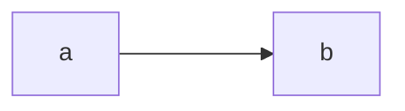

# Idioms in your code

## Use iterators

No, seriously, always. If you have to remember two things: `Option` is iterable. And you can chain iterators together.

Suppose you've got a situation where you might have a thing in variable A, and you might have zero or more things in variable B. In C++, you might need to process them by making a single list, or by calling a processing function twice. In Rust: chain them into a single iterator!



```rust
fn get_a_thing() -> Option<String> {
	Some("hello".into())
}

fn get_things() -> Vec<String> {
	vec!["bye".into(), "foo".into()]
}

fn main() {
	let all_the_things = get_a_thing()
		.into_iter()
		.chain(get_things().into_iter());
	for s in all_the_things {
		println!("{}", s);
	}
}
```


