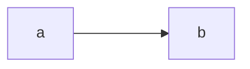

# Idioms in your code

## Use iterators

This is some daft example content to test publishing of Mermaid diagrams.

No, seriously, far more than you think makes sense. If you have to remember two things: `Option` is iterable. And you can chain iterators together.

Suppose you've got a situation where you might have a thing in variable A, and you might have zero or more things in variable B. In C++, you might need to process them by making a single list, or by calling a processing function twice. In Rust: chain them into a single iterator!



```rust
fn get_a_thing() -> Option<String> {
	Some("hello".into())
}
```


